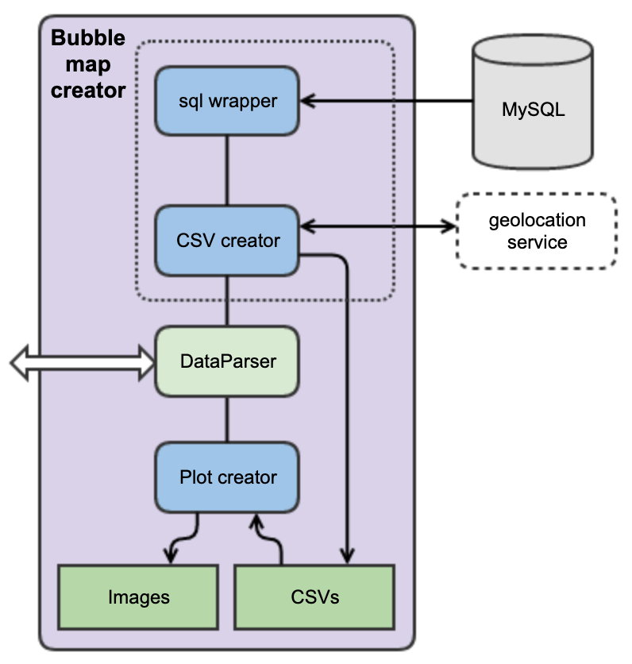

# Tournaments Visualizer

*    Title: Tournaments Visualizer     
*    Author: Guillem Alomar
*    Initial release: June 19th, 2019                     
*    Code version: 0.1                         
*    Availability: Public     

**Index**
* [Requirements](#requirements)
* [Documentation](#documentation)
    * [Application Architecture](#application-architecture)
* [Using the application](#using-the-application)
    * [First of all](#first-of-all)
    * [Executing](#executing)
    * [Additional Parameters](#additional-parameters)
* [Understanding the output](#understanding-the-output)
* [Comments](#comments)
* [Acknowledgements](#acknowledgements)

## Requirements

- Python +3.5
- basemap 1.2.0
- geopy 1.18.1
- matplotlib 3.0.2
- mysql-connector-python 8.0.14
- mysql-connector-python-rf 2.2.2
- numpy 1.16.0
- pandas 0.24.0

## Documentation

### Explanation

This project is about obtaining MTG tournaments data from a local csv file or a MySQL database, and plotting them on a world map. It connects to an external geolocation service to obtain the coordinates from the names of the locations.

### Application Architecture

<p align="center"></p>

## Using the application

### First of all

#### MySQL Configuration

You need to have a running MySQL instance accessible from your machine, and put the credentials for it in a new file _src/settings/creds.py_, with the same structure as the _creds_dummy.py_ file from that same folder.

The data in MySQL has to follow the next structure:

|  name   |         date        |      location     |  rules  | players |
|:-------:|:-------------------:|:-----------------:|:-------:|:-------:|
| Noobcon | YYYY-MM-DD 00:00:00 | Gotheburg, Sweden | Swedish |   120   |
|  LCOS   | YYYY-MM-DD 00:00:00 | Barcelona, Spain  | Swedish |    23   |
|  LMOS   | YYYY-MM-DD 00:00:00 |  Madrid, Spain    |   EC    |    22   |

Where **name, date** is the primary key.

#### Python libraries installation

- I recommend creating a virtualenv for this project. After creating it, you should run the following command:
```
~/RedditCrawler$ pip install -r requirements.frozen
```

To use Basemap is a little more complex than other python libraries.
I recommend using Conda to do it (I used version 4.3.16).

#### Image parameters

The parameters of the images that will be generated can be modified from the file _src/settings/\_\_init\_\_.py_

### Executing

This is done by typing the following command:
```
~/RedditCrawler$ python3 bubble.py
```

### Additional Parameters

```
usage: bubble.py [-h] [-f FILE]

Bubble map creator

optional arguments:
  -h, --help            show this help message and exit
  -f FILE, --file FILE  CSV input file. If not specified it will generate it from the MYSQL data.
 ```
 
 ## Understanding the output
 
Once the execution has finished, the resulting images will be stored in _data/images_. These images should look similar to this:
 
![alt text][logo2]

[logo2]: Documentation/ImageExample.png "Application Architecture"

The names of the images follow the next syntax:

```
$date.png
```

The resulting CSVs used to create the images can also be found in _data/csvs_. These csvs should look similar to this:

```
homelon;homelat;homecontinent;n
80.2838331;13.0801721;chennai, tamil nadu;3000
2.1774322;41.3828939;Barcelona;2250
-6.2602732;53.3497645;Dublin, Co. Dublin;2700
-4.2501672;55.8611389;Glasgow, Scotland;3600
-2.991665;53.407154;Liverpool, England;3150
-0.1276474;51.5073219;London, England;2250
-3.7035825;40.4167047;Madrid;1350
-2.2451148;53.4794892;Manchester, England;1800
5.09480471718312;52.2652457;ankeveen;1125
4.78130379920329;52.2336018;De Kwakel;6600
4.26968022053645;52.07494555;Den Haag;2850
5.7668453548675;50.81024155;eckelrade;375
5.478633;51.4392648;Eindhoven;1620
5.8870568;50.9189062;gemeente nuth;750
5.53460738161551;52.2379891;Nederland;3900
...
```

The names of the csvs follow the next syntax:

```
$date.csv
```

Logs can be found in _logs/bubble.log_ (if the folder and file don't exist, will be autogenerated at the beginning of the execution).

## Comments

- I have tested this application with input files with sizes in the order of MBs, with successful results. I'm not sure how would it perform with files of sizes in the order of GBs.
- In my production version of the code I have several fields in my MySQL database. In that case, you can add some other methods to the mysql_wrapper to filter by these fields. For this it would be useful to add new command line input parameters to specify which data you want to plot.

## Acknowledgements

- Some of the code was inspired by this great [post](https://python-graph-gallery.com/315-a-world-map-of-surf-tweets/) from the Python Graph Gallery website. Check it out!
- The geolocation service used is from [GeoPy](https://geopy.readthedocs.io/en/stable/), and it works great.
